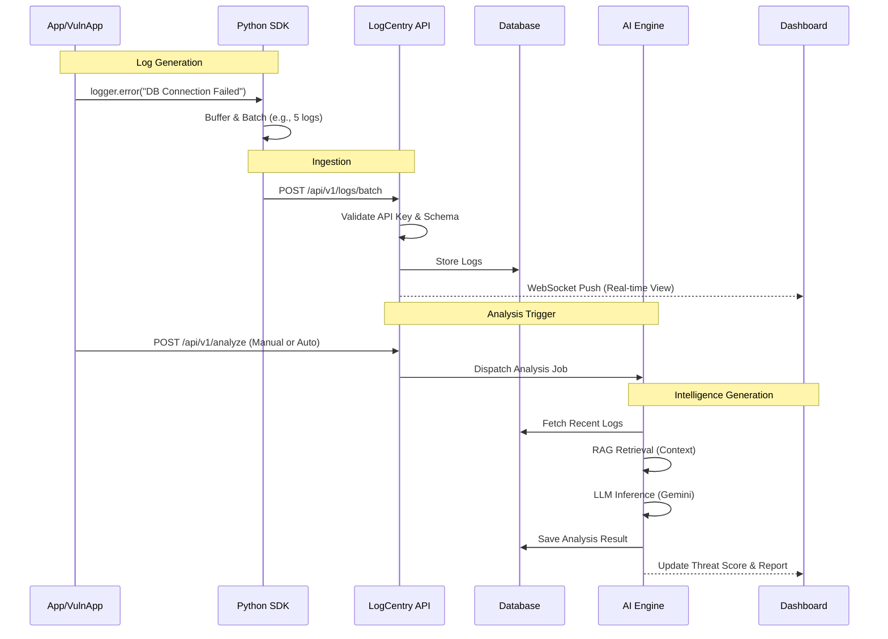
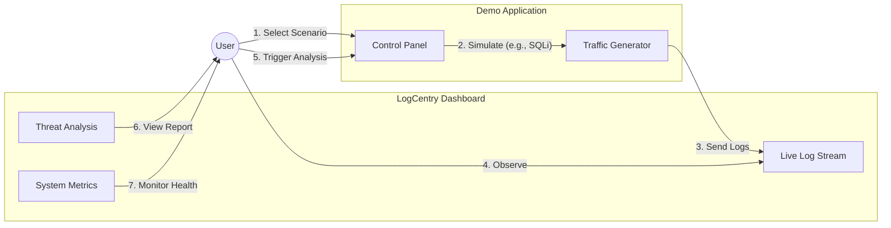
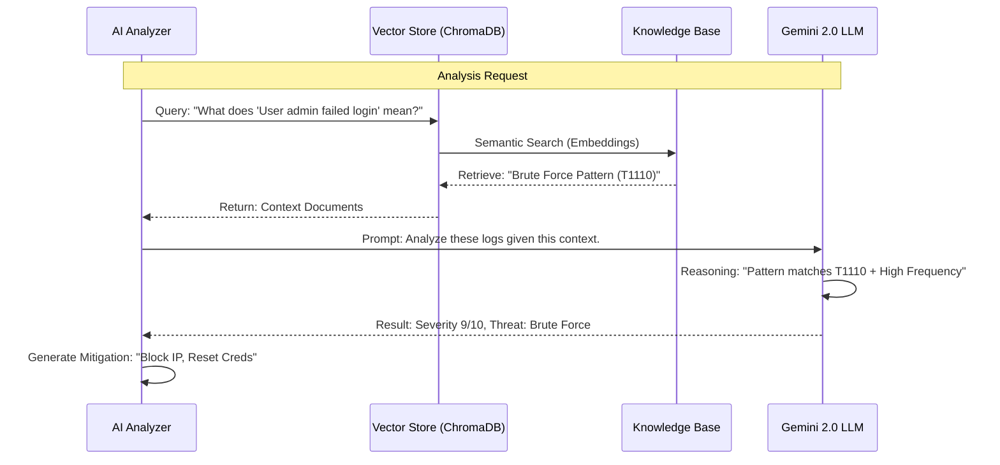

# LogCentry: In-Depth Project Overview

## 1. Executive Summary

**LogCentry** represents a paradigm shift in Security Information and Event Management (SIEM). Traditional SIEMs rely on static correlation rules that generate high volumes of false positives and require constant manual tuning. LogCentry addresses this by integrating **Large Language Models (LLM)** and **Retrieval-Augmented Generation (RAG)** directly into the analysis pipeline.

This allows the system to:
1.  **Understand Context**: Instead of just seeing "Failed Login", it sees "Failed Login on a critical server during off-hours by a user who usually logs in from a different country".
2.  **Reduce Noise**: LLMs can discern between benign anomalies and genuine threats with higher accuracy than regex-based rules.
3.  **Explain & Advise**: The system doesn't just alert; it explains the threat in plain English and provides actionable, context-aware countermeasures.

---

## 2. System Architecture

The architecture follows a modern, event-driven microservices design, centered around a high-performance API and an asynchronous AI analysis engine.

```mermaid
graph TD
    subgraph "Data Sources"
        App[Application Logs] -->|SDK/HTTP| API
        Sys[System Logs] -->|Agent| API
        Net[Network Traffic] -->|PCAP Wrapper| API
        Demo[VulnApp Demo] -->|SDK| API
    end

    subgraph "LogCentry Core"
        API[FastAPI Server]
        Auth[Auth Service<br/>(JWT/API Keys)]
        DB[(SQLite/Postgres)]
        Redis[(Redis Cache)]
        
        API --> Auth
        API --> DB
        API --> Redis
    end

    subgraph "Intelligence Layer"
        Analyzer[AI Threat Analyzer]
        RAG[RAG Pipeline]
        VectorDB[(ChromaDB)]
        LLM[Google Gemini 2.0]

        API -->|Async Job| Analyzer
        Analyzer -->|Context Query| RAG
        RAG -->|Retrieve| VectorDB
        Analyzer -->|Analysis Request| LLM
    end

    subgraph "Presentation Layer"
        Dash[Web Dashboard]
        WS[WebSocket Stream]
        
        API -->|Push| WS
        WS --> Dash
        API -->|REST| Dash
    end
```

### Component Deep Dive

## Getting Started (Developer)

Follow these minimal steps to run the project locally for development and demos.

```bash
# Create virtualenv and activate
python3 -m venv .venv
source .venv/bin/activate

# Install runtime dependencies and editable package
pip install -r requirements.txt
pip install -e .

# (Optional) install extras used by some features
pip install "python-jose[cryptography]" "pydantic[email]" sqlalchemy

# Start API server (recommended)
python -m logcentry --serve --server-port 8000

# Or use the helper to start API + demo app
./start_services.sh
```

Notes:
- The project installs from `src/` (editable mode) so changes are available without reinstalling.
- If you prefer running with Uvicorn directly, set your `PYTHONPATH` to the repository root or install in editable mode and then run:

```bash
uvicorn "logcentry.api.server:create_app" --factory --reload --host 0.0.0.0 --port 8000
```

#### A. Ingestion Layer (The "Ears")
*   **API Server**: Built with **FastAPI**, it handles high-throughput log ingestion via HTTP/2. It uses Pydantic models for strict data validation.
*   **SDK**: A lightweight Python client that batches logs and handles automatic retries (Circuit Breaker pattern), ensuring application performance isn't impacted by logging.
*   **Authentication**: Uses project-scoped **API Keys** for services and **JWT** for user sessions. API keys are cached in Redis for sub-millisecond validation.

#### B. The Core (The "Brain")
*   **Log Storage**: Logs are stored in a relational database optimized for time-series queries.
*   **Correlation Engine**: Runs lightweight, rule-based checks immediately upon ingestion to tag potential threats (e.g., "3 failed logins in 1 minute"). This acts as a first filter before the heavy AI analysis.

#### C. Intelligence Layer (The "Mind")
*   **Threat Analyzer**: An asynchronous worker that processes batches of suspicious logs.
*   **RAG Pipeline**:
    *   **Knowledge Base**: A curated collection of security knowledge, including the **MITRE ATT&CK** matrix, **CVE** databases, and custom organizational security policies, all vectorized in **ChromaDB**.
    *   **Retrieval**: When analyzing a log, the system queries the VectorDB: *"What does a 'blind SQL injection' look like?"* or *"What are the risks of error code 500 on /login?"*
    *   **Generation**: The LLM receiving the logs + the retrieved context generates a comprehensive threat assessment.

#### D. Presentation Layer (The "Face")
*   **Real-Time Dashboard**: A responsive web UI that receives live updates via WebSockets. It visualizes the threat landscape, displays raw logs, and presents the AI's findings.

---

## 3. Data Flow: The Life of a Log

This diagram illustrates how a single log message travels from generation to actionable insight.



---

## 4. User Interaction Flow (The Demo)

How a user interacts with the system during a demonstration or daily operation.



1.  **Selection**: The user selects a scenario in the VulnApp (e.g., "SQL Injection").
2.  **Simulation**: The VulnApp generates a burst of malicious traffic mixed with normal noise.
3.  **Observation**: The user sees these logs appear instantly on the LogCentry Dashboard.
4.  **Analysis**: The user triggers the AI analysis.
5.  **Insight**: The user reviews the generated report, which breaks down the attack vectors and suggests fixes.

---

## 5. Security & Isolation Design

LogCentry is designed with multi-tenancy in mind.

*   **Project Isolation**: Data is logically separated by `project_id`. An API key belongs to exactly one project, ensuring that Service A cannot write to Service B's logs.
*   **Zero-Knowledge Architecture (Optional)**: For highly sensitive deployments, LogCentry supports a ZK-proof authentication flow where the server never stores user passwords, not even as hashes.
*   **Audit Trails**: Every action (log ingestion, analysis trigger, rule creation) is itself logged to an internal audit trail, providing full accountability.

---

## 6. Comparison: Traditional SIEM vs. LogCentry

| Feature | Traditional SIEM | LogCentry AI |
| :--- | :--- | :--- |
| **Detection Logic** | Static Rules (Regex, Thresholds) | Semantic Understanding (LLM) |
| **False Positives** | High (Rules are rigid) | Low (Context-aware) |
| **New Threats** | Requires manual rule update | Can detect zero-day anomalies |
| **Response** | Generic "Alert Triggered" | Detailed remediation steps |
| **Context** | Limited to log data | Enriched with Wiki/CVE knowledge (RAG) |

---

## 7. Deep Dive: AI Threat Analysis & RAG

The core innovation of LogCentry lies in its ability to contextually analyze logs. This section details how the **Intelligence Layer** functions.

### The Problem with Traditional Analysis
In a traditional SIEM, a rule might say: `IF log.level == "ERROR" AND log.message CONTAINS "DB Connection Failed" THEN Alert`.
*   **Result**: Hundreds of alerts during a scheduled maintenance window.
*   **Reality**: This is noise, not a threat.

### The LogCentry Approach

LogCentry uses a **Retrieval-Augmented Generation (RAG)** pipeline to fetch context *before* asking the AI for an opinion.



1.  **Vectorization**: Security documents (MITRE ATT&CK, internal wikis, CVEs) are converted into vector embeddings.
2.  **Semantic Search**: When a log comes in, we search the vector database for "conceptually similar" security concepts.
3.  **Context Injection**: We feed the LLM the raw logs *plus* the retrieved security knowledge.
4.  **Informed Decision**: The LLM output is grounded in verified security frameworks, reducing hallucinations and providing concrete references (e.g., "See MITRE T1110").

---

## 8. Dashboard & Visualization

The Dashboard is the command center for security operations. It is designed for **situational awareness**.

### Key Interface Elements

1.  **Live Log Stream**: A scrolling feed of ingested logs. Color-coded by severity (Green=Info, Yellow=Warn, Red=Error/Critical).
    *   *Why?* Allows operators to spot visual anomalies instantly.
2.  **Severity Gauge**: A prominent visualization of the current threat level (0-10).
    *   *Why?* Provides immediate "at-a-glance" status of system health.
3.  **Threat Assessment Panel**: A text area where the AI explains its findings.
    *   *Why?* "Explainable AI" is critical for trust. Operators need to know *why* the system thinks something is wrong.
4.  **Countermeasures List**: Actionable steps to remediate threats.
    *   *Why?* Reduces "Time to Response" by providing a checklist for the SOC analyst.

### Technology Stack
*   **Frontend**: HTML5/CSS3 (Grid/Flexbox) with vanilla JavaScript for lightweight performance.
*   **Real-time Updates**: `WebSocket` connection to the API server ensures the dashboard reflects the state of the system with <50ms latency.
*   **Interactive Elements**: Buttons to trigger manual analysis or clear alerts.

---

## 9. Future Roadmap

LogCentry is an evolving platform. Key areas for future development include:

*   **Automated Remediation**: Allow the AI to execute the countermeasures it suggests (e.g., automatically adding a firewall rule via API).
*   **Support for More Sources**: Native integration with AWS CloudWatch, Azure Sentinel, and Kubernetes logs.
*   **Fine-Tuning**: Ability to fine-tune the backend Gemini model on an organization's specific historical logs for even higher accuracy.

---

## 10. Conclusion

LogCentry demonstrates that the future of security is **context-aware**. By marrying the speed of modern log ingestion with the intelligence of Large Language Models, it provides a comprehensive solution for detecting, analyzing, and responding to cyber threats in real-time.

It transforms the role of a security analyst from "Log Hunter" to "Threat Hunter", empowered by an AI assistant that never sleeps and knows the entire MITRE framework by heart.
